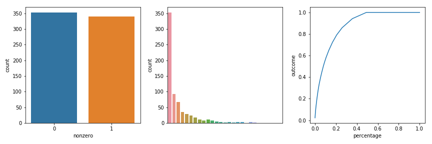
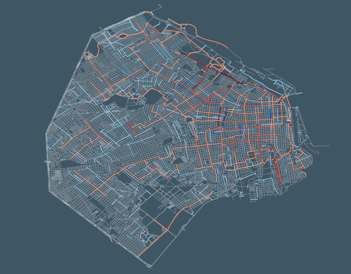

# 🚴🏽‍♀️💥🚗 Do streets with cycle-track report less car collision that streets without them? A matching pairs study.

*by* Agustin Rodriguez

#### Summary

Cycle-tracks are exclusive street-level bike-ways separated by physical barriers from the roadway. On the last 5 years, Buenos Aires has been developing its bicycle infrastructure at a fast rate by construction cycle-tracks around the city. On this analysis we aim to observe the effect that cycle-tracks had on reported car collisions.

A retrospective matching pairs study design was conducted, were 346 Buenos Aires streets were identify as having cycle-tracks. Using nearest neighbor search, a match for each street was found by looking for streets with similar geographical location, length, number of businesses per 100 meters and matching by street/avenue and one/two-way categorical variables. 

Car collisions were defined as any death or injury were a vehicle (automobile, motorbikes, bus or others) was involved. All data comes form a 2017 car collisions database. It is expected that only the most serious car collisions were reported. Reported collisions count assessment from all 692 streets revealed a zero inflated distribution. A high number of 0 collisions reported could be generated by 3 different process:

1. Streets that cannot have car collision in them.
2. Streets were collisions are less likely to be reported.
3. Streets neither in both categories that just happens to have 0 car collisions reported during 2017.

Modeling of zero inflated count data was done using a hurdle model which divided the count data in two groups. The zero group consisting on all cases where the collisions count was 0 and the nonzero group for all the cases where the count number was a nonzero positive. On the former group, a logistic regression model was fitted to assessed the odds of having a 0 count, while on the latter a negative binomial regression was used to see the relative differences on the collision counts.

The presence of cycle-tracks on a streets decreased the odds of having a zero car collisions count by 0.20 (CI 0.09 - 0.46); Read as for every 1 cycle-tracked street with a 0 count, 5 non-cycle-track street with a 0 count existed). But on those streets with positive nonzero car collisions count, no statistically significant difference were observed with the presence or absence of cycle-tracks (RR 1.15 CI 0.90 - 1.45) .

In conclusion, cycle-tracks could be making streets more prone to car collisions but with no more car collisions count than those seen on the streets that already were prone to car collisions.

## Figures

  

**Figure one**: Three figures showing data structure. Left figure shows the proportion of zero count (left)  vs nonzero counts (right). Middle figure shows a histogram of counts frequencies. Right figure shows a gini plot of the cumulative count distribution.

  

**Figure two:** A map of Buenos Aires showing all streets. Streets that were enroll in the matching are show in red or blue colors depending if they had cycle-tracks or not respectively. The intensity of the color is proportional to the car collisions count observed in each segment.